# 🛍️ Zentro - Modern E-Commerce Platform

<div align="center">

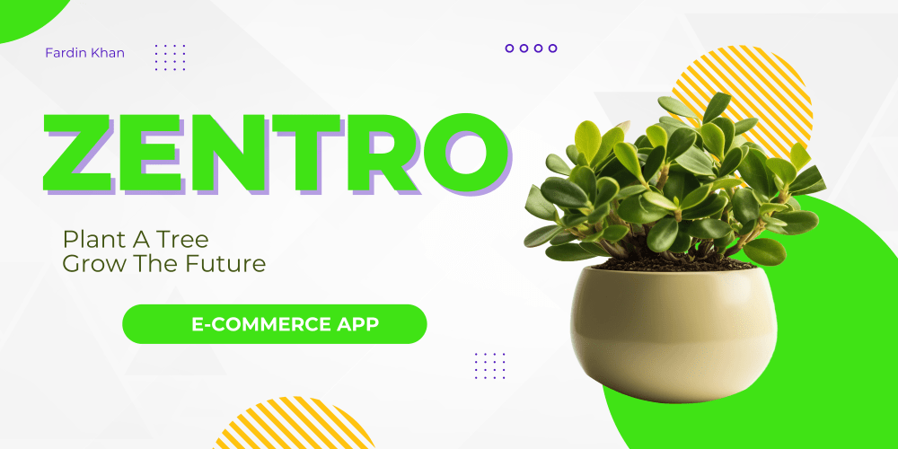

**A production-ready, full-stack e-commerce platform built with modern technologies**

[](https://choosealicense.com/licenses/mit/)
[](https://nodejs.org/)
[](https://react.dev/)
[](https://www.mongodb.com/)
[](https://redis.io/)

---

### 🌐 Live Demo

[](https://zentro-cyan.vercel.app)
[](https://zentro-e8ga.onrender.com/api/health)

**🔗 Quick Links:**
- **Frontend**: [zentro-cyan.vercel.app](https://zentro-cyan.vercel.app)
- **Backend API**: [zentro-e8ga.onrender.com](https://zentro-e8ga.onrender.com)
- **API Health**: [zentro-e8ga.onrender.com/api/health](https://zentro-e8ga.onrender.com/api/health)

**Note:** Feel free to use the your own credentials for testing purposes.

---

[Features](#-features) • [Tech Stack](#-tech-stack) • [Screenshots](#-screenshots) • [Quick Start](#-quick-start) • [Deployment](#-deployment) • [API Docs](#-api-documentation)

</div>

---

## 📸 Screenshots

<div align="center">

### Homepage

*Modern landing page with featured products*

### Product Catalog
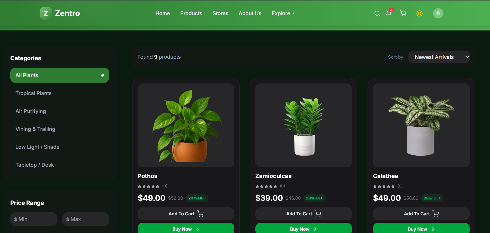
*Advanced filtering and search capabilities*

### Product Details
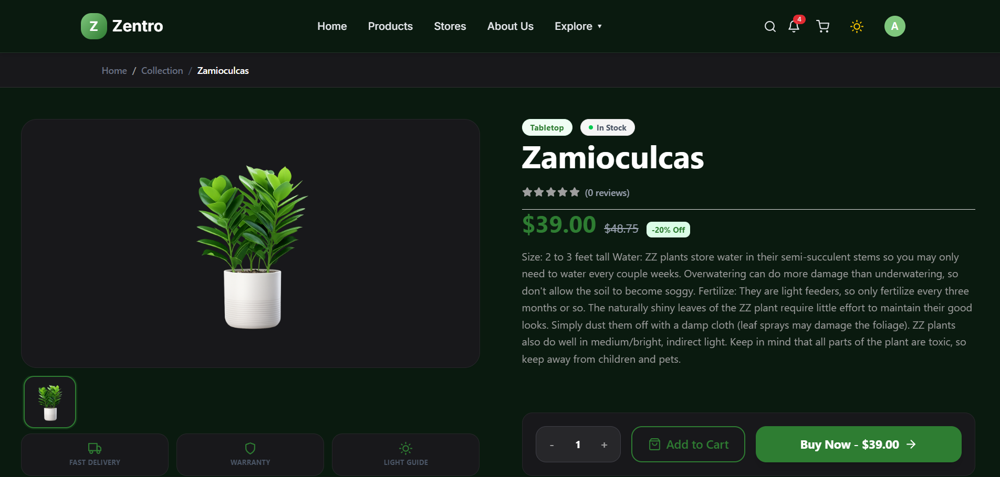
*Detailed product view with reviews and related items*

### Shopping Cart
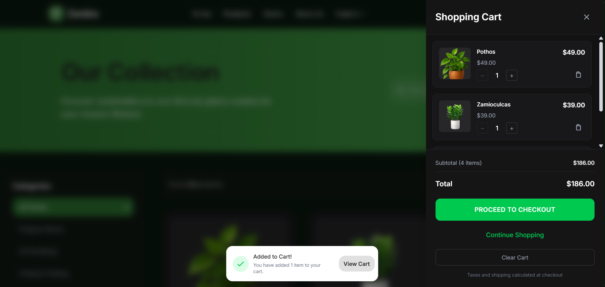
*Real-time cart with inventory status*

### Checkout Process
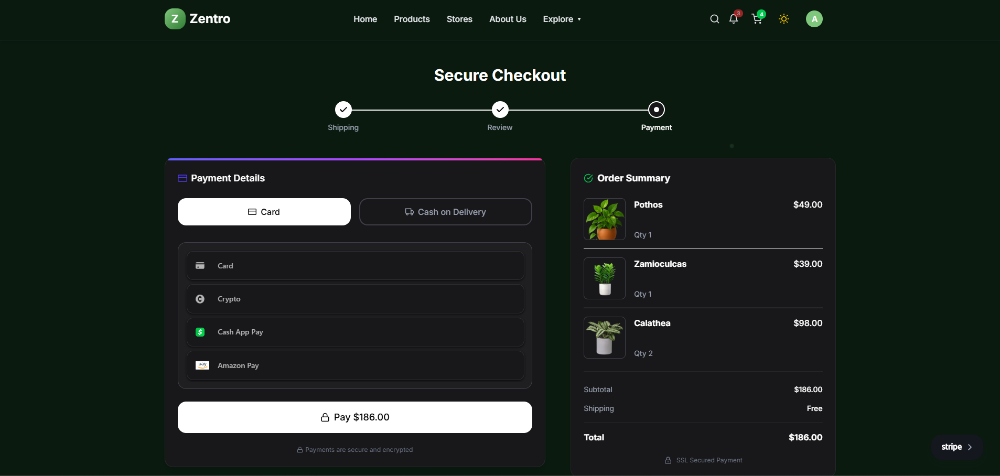
*Secure Stripe payment integration*

### Order Confirmation
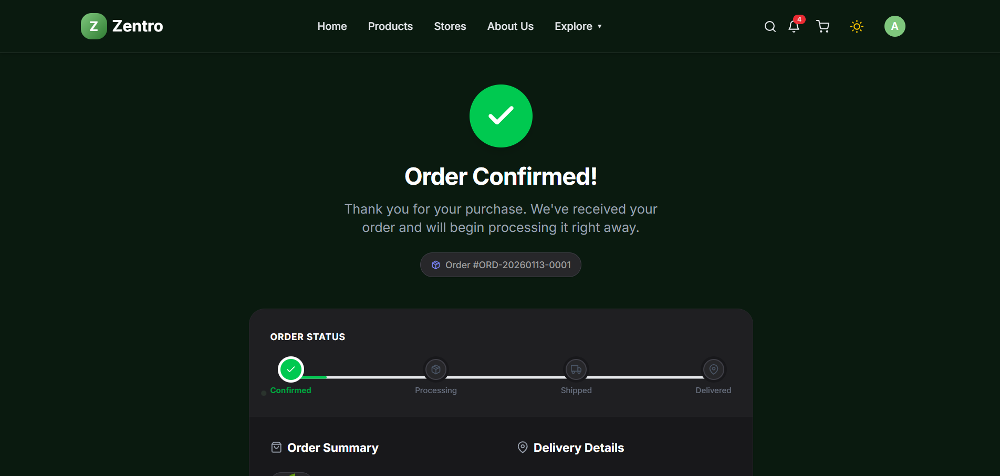
*Order confirmation page with order details*

### Order History
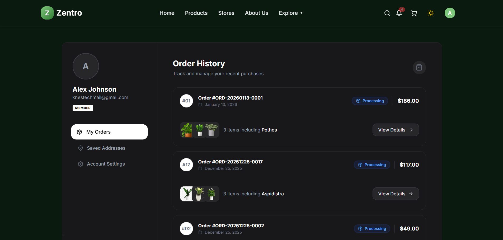
*View and manage past orders*

### Admin Dashboard
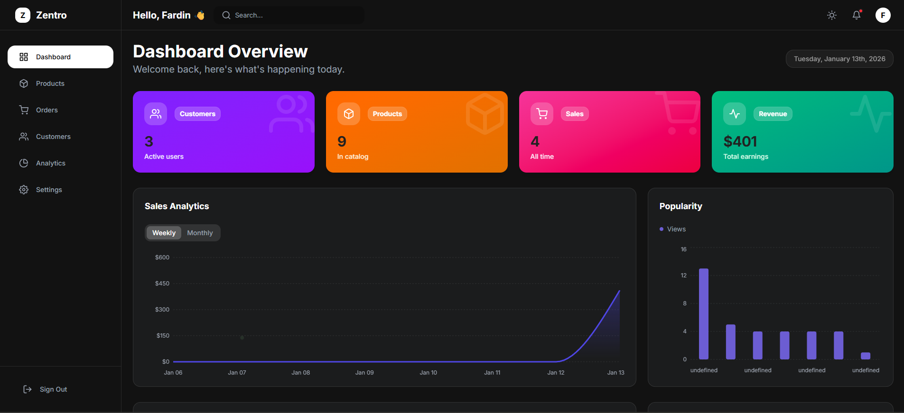
*Comprehensive admin panel with analytics*

---

### Mobile Views

<table>
  <tr>
    <td align="center" width="33%">
      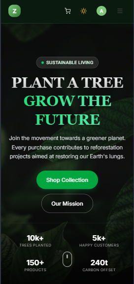
      <br />
      <strong>Homepage</strong>
    </td>
    <td align="center" width="33%">
      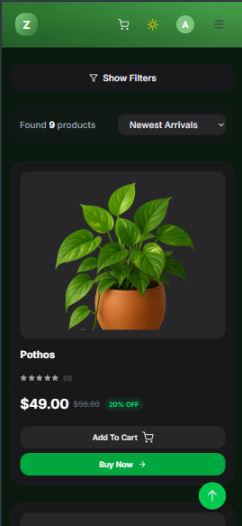
      <br />
      <strong>Products</strong>
    </td>
    <td align="center" width="33%">
      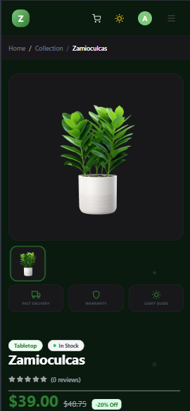
      <br />
      <strong>Product Detail</strong>
    </td>
  </tr>
  <tr>
    <td align="center" width="33%">
      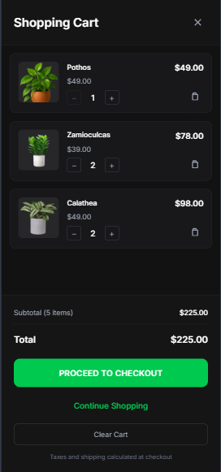
      <br />
      <strong>Shopping Cart</strong>
    </td>
    <td align="center" width="33%">
      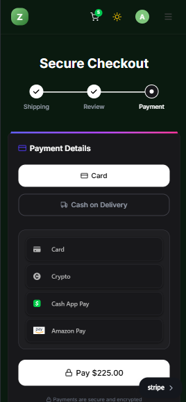
      <br />
      <strong>Checkout</strong>
    </td>
    <td align="center" width="33%">
      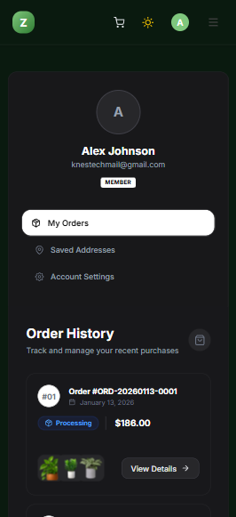
      <br />
      <strong>User Profile</strong>
    </td>
  </tr>
</table>

</div>

---

## 🎬 Premium Scrollytelling Experience

<div align="center">

### ✨ Immersive Canvas-Based Scroll Animation

**Experience the future of product showcases**


*Smooth 192-frame canvas animation that responds to scroll*

</div>

### 🎨 What Makes It Special?

<table>
  <tr>
    <td width="50%" valign="top">
      
#### 🎯 **Canvas-Driven Animation**
- **192 high-quality frames** loaded and rendered in real-time
- Smooth **60fps** scroll-synchronized playback
- Full-screen immersive experience
- Zero video lag or buffering

#### 🌊 **Scroll-Triggered Flow**
- Product name and price appear at start
- Text elegantly fades out to reveal product
- Each scroll position maps to a specific frame
- Buttery smooth transitions throughout

    </td>
    <td width="50%" valign="top">
      
#### ⚡ **Performance Optimized**
- Intelligent image preloading
- Responsive canvas sizing
- RAF-based rendering for 60fps
- Minimal memory footprint

#### 🎭 **Modern Tech Stack**
- **Framer Motion** for scroll tracking
- **HTML5 Canvas** for rendering
- **React Hooks** for state management
- **Tailwind CSS** for styling

    </td>
  </tr>
</table>

### 🚀 How to Experience It

```bash
# Navigate to the experience page
http://localhost:5173/experience

# Or in production
https://zentro-cyan.vercel.app/experience
```

**Try it yourself:**
1. Visit the `/experience` route
2. Watch the product name and price appear
3. Start scrolling down slowly
4. Watch the magic unfold! ✨

### 💎 Technical Highlights

- **Image Sequence**: 192 individual frames create fluid motion
- **Scroll Mapping**: Each scroll position corresponds to a specific frame (0-191)
- **Cover Fit**: Frames fill the entire viewport for maximum impact
- **Fade Effects**: Text smoothly fades out (0-25% scroll) to showcase the product
- **Responsive**: Works flawlessly on desktop, tablet, and mobile devices

> **Note**: This is not a video or GIF - it's a real-time canvas animation synchronized with your scroll position, giving you complete control over the playback!

---

## ✨ Features

### 🔐 **Authentication & Authorization**
- JWT with HttpOnly cookies + Refresh tokens
- Google OAuth 2.0 integration
- Two-Factor Authentication (2FA) via email OTP
- Email verification & password reset
- Redis-backed session management

### 🛒 **Shopping Experience**
- Advanced product filtering & search
- Redis-cached product listings for performance
- Real-time inventory management
- Shopping cart with persistence
- AI-powered product descriptions (Google Gemini)
- Image upload with Cloudinary

### 💳 **Payments & Orders**
- Stripe payment integration
- Secure checkout flow
- Order tracking & history
- Email notifications via BullMQ
- Concurrency control for inventory

### ⚡ **Real-Time Features**
- Socket.IO for live updates
- Redis pub/sub for multi-instance scaling
- Real-time order status notifications
- Cross-tab cart synchronization

### 🤖 **Automation & Background Jobs**
- **n8n workflow integration** for automation
- BullMQ job queues (email, analytics, AI tasks)
- Optimized worker concurrency for free hosting
- PM2 process management in production

### 📊 **Admin Dashboard**
- Product management (CRUD operations)
- Order management & fulfillment
- User management
- Analytics & reporting
- Settings configuration

### 🎨 **UI/UX**
- Responsive design with Tailwind CSS v4
- Dark mode support
- Smooth animations with Framer Motion
- Toast notifications
- Loading states & error handling

---

## 🚀 Tech Stack

### **Frontend**
- **React 19** - UI library
- **Vite** - Build tool & dev server
- **Redux Toolkit** - State management
- **RTK Query** - Data fetching & caching
- **React Router** - Client-side routing
- **React Hook Form** - Form management
- **Zod** - Schema validation (shared with backend)
- **Tailwind CSS v4** - Utility-first styling
- **Framer Motion** - Animations
- **Socket.IO Client** - Real-time communication
- **Stripe.js** - Payment processing

### **Backend**
- **Node.js 18+** with Express.js
- **MongoDB** with Mongoose ODM
- **Redis** - Caching, sessions, pub/sub, queues
- **BullMQ** - Job queue system
- **Socket.IO** - WebSocket server
- **JWT** - Authentication
- **Passport.js** - OAuth strategies
- **Zod** - Request validation
- **Stripe** - Payment gateway
- **Cloudinary** - Image storage
- **Google Gemini AI** - AI-powered features
- **Nodemailer** - Email service
- **Pino** - Structured logging

### **DevOps & Infrastructure**
- **Docker** & Docker Compose
- **PM2** - Process manager
- **Nginx** - Reverse proxy
- **MongoDB Atlas** - Cloud database
- **Upstash Redis** - Serverless Redis
- **Vercel** - Frontend hosting
- **Render.com** - Backend hosting
- **GitHub Actions** - CI/CD

---

## 📁 Project Structure

```
Zentro-Ecom App/
├── client/                     # React frontend
│   ├── src/
│   │   ├── app/               # Redux store & RTK Query
│   │   ├── features/          # Feature slices (auth, products, cart, orders)
│   │   ├── components/        # Reusable UI components
│   │   ├── pages/             # Page components
│   │   ├── hooks/             # Custom React hooks
│   │   ├── validations/       # Zod schemas (mirrored from backend)
│   │   └── utils/             # Helper functions
│   ├── public/                # Static assets
│   ├── Dockerfile             # Production build
│   └── vite.config.js         # Vite configuration
│
└── server/                     # Node.js backend
    ├── src/
    │   ├── config/            # Database, Redis, Cloudinary, Stripe, Passport
    │   ├── models/            # Mongoose schemas
    │   ├── controllers/       # Request handlers
    │   ├── middleware/        # Express middleware
    │   ├── routes/            # API route definitions
    │   ├── services/          # Business logic (email, AI, analytics)
    │   ├── jobs/              # BullMQ queues & workers
    │   ├── validations/       # Zod validation schemas
    │   ├── websocket/         # Socket.IO events
    │   └── utils/             # Helpers & utilities
    ├── server.js              # Express app entry point
    ├── worker.js              # Background worker entry
    ├── ecosystem.config.js    # PM2 configuration
    └── Dockerfile             # Production build
```

---

## 🏃 Quick Start

### **Prerequisites**
- Node.js 18+ and npm
- MongoDB (local or Atlas)
- Redis (local or Upstash)
- Docker & Docker Compose (optional)

### **1. Clone the Repository**
```bash
git clone https://github.com/FardinKhan-Dev/Zentro.git
cd Zentro-Ecom\ App
```

### **2. Install Dependencies**
```bash
# Install server dependencies
cd server
npm install

# Install client dependencies
cd ../client
npm install
```

### **3. Environment Configuration**

Create `.env` files based on `.env.example`:

**Server `.env`:**
```env
NODE_ENV=development
PORT=5000

# Database
MONGODB_URI=mongodb://localhost:27017/zentro

# Redis
REDIS_URL=redis://localhost:6379

# JWT Secrets (generate with: node -e "console.log(require('crypto').randomBytes(32).toString('hex'))")
JWT_ACCESS_SECRET=your_access_secret_here
JWT_REFRESH_SECRET=your_refresh_secret_here
JWT_ACCESS_EXPIRES_IN=15m
JWT_REFRESH_EXPIRES_IN=7d

# Google OAuth
GOOGLE_CLIENT_ID=your_client_id.apps.googleusercontent.com
GOOGLE_CLIENT_SECRET=your_client_secret
GOOGLE_CALLBACK_URL=http://localhost:5000/api/auth/google/callback

# Cloudinary
CLOUDINARY_CLOUD_NAME=your_cloud_name
CLOUDINARY_API_KEY=your_api_key
CLOUDINARY_API_SECRET=your_api_secret

# Stripe
STRIPE_SECRET_KEY=sk_test_your_key
STRIPE_PUBLISHABLE_KEY=pk_test_your_key

# Gmail OAuth2 (for emails)
EMAIL_USER=your_email@gmail.com
GMAIL_CLIENT_ID=your_gmail_client_id
GMAIL_CLIENT_SECRET=your_gmail_secret
GMAIL_REFRESH_TOKEN=your_refresh_token

# Optional: Gemini AI
GEMINI_API_KEY=your_gemini_api_key

# Optional: n8n Automation
N8N_WEBHOOK_URL=http://localhost:5678/webhook
```

**Client `.env`:**
```env
VITE_API_URL=http://localhost:5000
```

### **4. Run the Application**

**Option A: Docker Compose (Recommended)**
```bash
docker-compose up --build
```

**Option B: Manual**
```bash
# Terminal 1: Start MongoDB & Redis
# (If not using Docker)

# Terminal 2: Start server
cd server
npm run dev

# Terminal 3: Start worker
cd server
npm run worker:dev

# Terminal 4: Start client
cd client
npm run dev
```

### **5. Access the Application**
- **Frontend**: http://localhost:5173
- **Backend API**: http://localhost:5000
- **API Health**: http://localhost:5000/api/health

---

## 🌐 Deployment

### **Free Tier Deployment Stack**

| Service | Platform | Purpose |
|---------|----------|---------|
| **Frontend** | Vercel | React app hosting |
| **Backend** | Render.com | Node.js API + Worker |
| **Database** | MongoDB Atlas | Free 512MB cluster |
| **Redis** | Upstash | Free tier (10K commands/day) |
| **Images** | Cloudinary | Free 10GB storage |

**Total Cost: $0/month** 🎉

### **Deployment Steps**

See the comprehensive [Free Tier Deployment Guide](./docs/FREE_TIER_DEPLOYMENT.md) for detailed instructions.

**Quick summary:**
1. Deploy frontend to Vercel
2. Create MongoDB Atlas database
3. Create Upstash Redis instance
4. Deploy backend to Render with PM2 ecosystem config
5. Set environment variables on all platforms
6. Set up UptimeRobot to prevent cold starts

### **Production Optimizations**

✅ **PM2 Configuration**: API + Worker run together in one process  
✅ **Worker Concurrency**: Optimized for 512MB RAM limit  
✅ **Health Check Endpoint**: `/api/health` monitors all services  
✅ **Logging**: Pino with production JSON logs  
✅ **Caching**: Redis-backed caching for better performance  

---

## 📚 API Documentation

### **Authentication**
```
POST   /api/auth/register           Register new user
GET    /api/auth/verify-email/:token  Verify email
POST   /api/auth/login              Login with credentials
POST   /api/auth/verify-otp         Verify 2FA OTP
GET    /api/auth/google             Google OAuth login
GET    /api/auth/google/callback    OAuth callback
POST   /api/auth/logout             Logout user
GET    /api/auth/refresh            Refresh access token
POST   /api/auth/request-reset      Request password reset
POST   /api/auth/reset-password     Reset password
POST   /api/auth/change-password    Change password (protected)
```

### **Products**
```
GET    /api/products                List products (with filters)
GET    /api/products/:id            Get product details
POST   /api/products                Create product (admin)
PATCH  /api/products/:id            Update product (admin)
DELETE /api/products/:id            Delete product (admin)
```

### **Cart**
```
GET    /api/cart                    Get user cart
POST   /api/cart                    Add item to cart
PATCH  /api/cart/:itemId            Update cart item
DELETE /api/cart/:itemId            Remove from cart
DELETE /api/cart                    Clear cart
```

### **Orders**
```
POST   /api/orders                  Create order
GET    /api/orders                  List user orders
GET    /api/orders/:id              Get order details
PATCH  /api/orders/:id/cancel       Cancel order
```

### **Payments**
```
POST   /api/payments/create-intent  Create Stripe payment intent
POST   /api/payments/webhook        Stripe webhook handler
```

### **Reviews**
```
POST   /api/reviews                 Create review
GET    /api/reviews/product/:id     Get product reviews
PATCH  /api/reviews/:id             Update review
DELETE /api/reviews/:id             Delete review
```

### **Admin**
```
GET    /api/admin/dashboard         Dashboard statistics
GET    /api/admin/users             List all users
PATCH  /api/admin/users/:id         Update user role
GET    /api/admin/orders            List all orders
PATCH  /api/admin/orders/:id        Update order status
```

### **Health Check**
```
GET    /api/health                  System health status
```

---

## 🧪 Testing

```bash
# Run tests
cd server
npm test

# Run tests with coverage
npm run test:coverage

# Run specific test file
npm test -- auth.test.js
```

---

## 🛠️ Development

### **Code Quality**
```bash
# Lint
npm run lint

# Fix lint issues
npm run lint:fix

# Format code
npm run format
```

### **Database Seeding**
```bash
cd server
npm run seed          # Seed sample data
npm run seed:clear    # Clear database
```

### **Generate JWT Secrets**
```bash
node -e "console.log(require('crypto').randomBytes(32).toString('hex'))"
```

---

## 🤝 Contributing

Contributions are welcome! Please follow these steps:

1. Fork the repository
2. Create a feature branch: `git checkout -b feature/amazing-feature`
3. Commit your changes: `git commit -m 'Add amazing feature'`
4. Push to the branch: `git push origin feature/amazing-feature`
5. Open a Pull Request

### **Development Guidelines**
- Follow existing code style
- Write meaningful commit messages
- Add tests for new features
- Update documentation as needed

---

## 📄 License

This project is licensed under the MIT License - see the [LICENSE](LICENSE) file for details.

---

## 🙏 Acknowledgments

- **React Team** for the amazing React library
- **Vercel** for Vite and excellent hosting
- **Stripe** for payment infrastructure
- **MongoDB Atlas** for database hosting
- **Upstash** for serverless Redis
- **Cloudinary** for image management

---

## 📧 Contact & Support

- **Author**: Fardin Khan
- **GitHub**: [@FardinKhan-Dev](https://github.com/FardinKhan-Dev)
- **LinkedIn**: [Connect with me](www.linkedin.com/in/fardin-khan-dev)
- **Email**: fardinkhan8637@gmail.com
- **Issues**: [GitHub Issues](https://github.com/FardinKhan-Dev/Zentro/issues)

### 💬 Get Help
- 🐛 Report bugs via GitHub Issues
- 💡 Request features via GitHub Issues
- ⭐ Star the repo if you find it useful!

---

<div align="center">

**⭐ If you found this project helpful, please give it a star!**

Made with ❤️ using React, Node.js, and MongoDB

</div>
